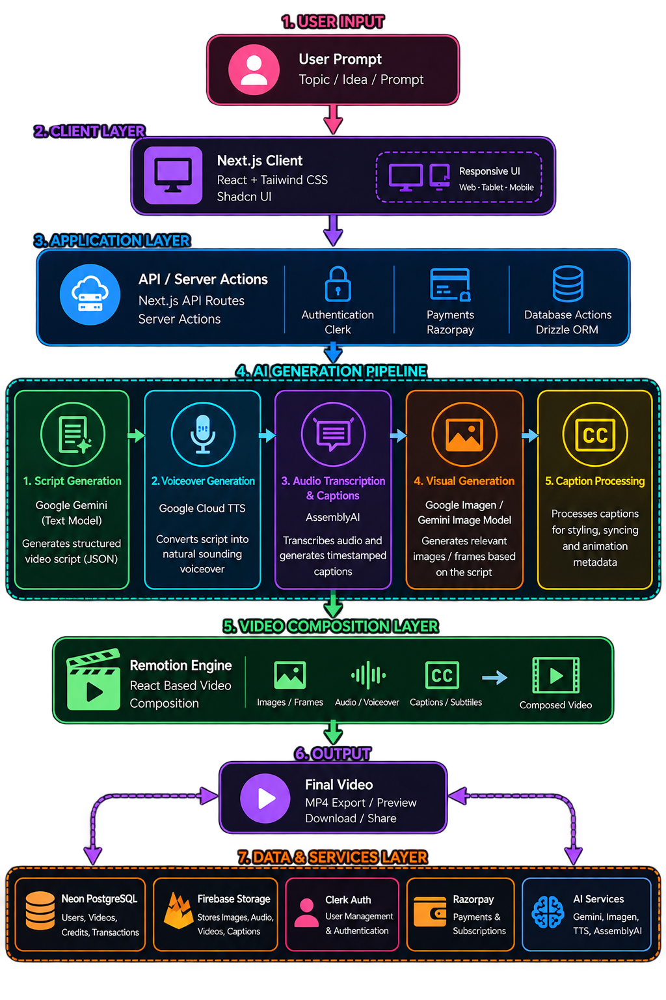

<div align="center">


<br />

<strong>A high-end AI-powered video generation platform.</strong>

<p>
Transform a simple text prompt into a fully rendered short-form video with
AI-generated scripts, visuals, voiceovers, captions, and dynamic video composition.
</p>

<p align="center">
  
  
  
  
  
</p>

<p align="center">
  
  
  
  
  
  
</p>

</div>

---

## 1. Overview

**Lumiere AI** is an AI-powered video generation platform designed to transform a simple idea or prompt into a complete short-form video.

The application orchestrates multiple AI services to generate a structured video script, visuals, voiceover, subtitles, and a final composited video. Built with a modern serverless architecture, Lumiere AI combines AI generation, cloud storage, authentication, payments, and browser-based video rendering into a single seamless workflow.

---

## 2. Key Features

* **Intelligent Storytelling**
  Generates creative, structured video scripts tailored to different video durations using **Google Gemini**.

* **AI-Generated Visuals**
  Dynamically generates visuals and frames based on the generated video script using Google's image generation models.

* **Neural Voice Generation**
  Converts generated scripts into natural-sounding voiceovers using **Google Cloud Text-to-Speech**.

* **Precision Subtitling**
  Uses **AssemblyAI** to transcribe generated audio and create timestamp-based captions.

* **Dynamic Video Composition**
  Uses **Remotion** and **WebCodecs** to programmatically compose visuals, voiceovers, and captions into a final video.

* **Credit-Based Generation System**
  Includes a credit system for video generation with secure payment integration through **Razorpay**.

* **Authentication & Cloud Storage**
  User authentication is handled by **Clerk**, while generated media assets are securely stored using **Firebase Storage**.

---

## 3. Architecture

Lumiere AI follows a modern serverless architecture built around the **Next.js App Router**.

<div align="center">
  
</div>

### Application Layers

1. **Client Layer**
   A responsive user interface built with **Next.js, React, Tailwind CSS, and shadcn/ui**.

2. **Application Layer**
   Next.js API routes and Server Actions handle authentication, AI generation workflows, database operations, and payments.

3. **AI Generation Pipeline**
   The platform processes the user's prompt through multiple services to generate:

   ```text
   Prompt
      ↓
   Video Script
      ↓
   Voiceover
      ↓
   Audio Transcription & Captions
      ↓
   AI-Generated Visuals
   ```

4. **Video Composition Layer**
   **Remotion** programmatically combines generated images, audio, and timestamped captions into a React-based video composition.

5. **Data Layer**
   **Neon PostgreSQL**, managed through **Drizzle ORM**, stores user data, video metadata, and credit balances.

---

## 4. Tech Stack

| Category           | Technologies                                                         |
| :----------------- | :------------------------------------------------------------------- |
| **Frontend**       | Next.js, React, Tailwind CSS, JavaScript, shadcn/ui                  |
| **Backend**        | Node.js, Next.js API Routes, Server Actions                          |
| **Database**       | Neon PostgreSQL, Drizzle ORM                                         |
| **AI**             | Google Gemini, Google Image Generation, Google Cloud TTS, AssemblyAI |
| **Video Engine**   | Remotion, WebCodecs                                                  |
| **Authentication** | Clerk                                                                |
| **Storage**        | Firebase Storage                                                     |
| **Payments**       | Razorpay                                                             |

---

## 5. Project Structure

```text
.
├── app/
│   ├── (auth)/                 # Authentication routes
│   ├── _context/               # Global React contexts
│   ├── api/                    # API routes and backend logic
│   ├── dashboard/              # Protected dashboard and video creation UI
│   ├── actions.js              # Next.js Server Actions
│   ├── layout.js               # Root layout and global providers
│   └── page.js                 # Landing page
│
├── components/
│   └── ui/                     # Reusable shadcn/ui components
│
├── configs/
│   ├── AIModel.js              # Google AI configuration
│   ├── db.js                   # Neon + Drizzle database configuration
│   ├── FirebaseConfig.js       # Firebase and Storage configuration
│   └── schema.js               # Database schemas
│
├── lib/
│   └── utils.js                # Shared utility functions
│
├── public/                     # Static assets
│
└── remotion/                   # Video compositions and rendering setup
```

---

## 6. Environment Variables

Create a `.env.local` file in the root directory of the project and add the required environment variables.

```env
# Google AI
GOOGLE_API_KEY=

# Google Cloud Text-to-Speech
GOOGLE_APPLICATION_CREDENTIALS=

# AssemblyAI
ASSEMBLYAI_API_KEY=

# Database
DATABASE_URL=

# Clerk
NEXT_PUBLIC_CLERK_PUBLISHABLE_KEY=
CLERK_SECRET_KEY=

# Firebase
NEXT_PUBLIC_FIREBASE_API_KEY=
NEXT_PUBLIC_FIREBASE_AUTH_DOMAIN=
NEXT_PUBLIC_FIREBASE_PROJECT_ID=
NEXT_PUBLIC_FIREBASE_STORAGE_BUCKET=
NEXT_PUBLIC_FIREBASE_MESSAGING_SENDER_ID=
NEXT_PUBLIC_FIREBASE_APP_ID=

# Razorpay
NEXT_PUBLIC_RAZORPAY_KEY_ID=
RAZORPAY_KEY_SECRET=
```

> **Note:** The exact environment variable names may differ depending on your implementation. Never commit `.env.local` or API keys to your repository.

---

## 7. Getting Started

### 1. Clone the repository

```bash
git clone https://github.com/sohel-470/Lumiere-AI.git
cd lumiere-ai
```

### 2. Install dependencies

```bash
npm install
```

### 3. Configure environment variables

Create a `.env.local` file and add the required API keys and configuration values.

### 4. Set up the database

Configure your Neon PostgreSQL database and run the required Drizzle migrations.

```bash
npm run db:push
```

### 5. Start the development server

```bash
npm run dev
```

Open:

```text
http://localhost:3000
```

---

## 8. Video Generation Pipeline

```text
User Prompt
    ↓
AI Script Generation
    ↓
Voiceover Generation
    ↓
Audio Transcription
    ↓
AI Image Generation
    ↓
Caption Processing
    ↓
Remotion Composition
    ↓
Final Rendered Video
```

---

## 9. Security

Sensitive API keys and credentials are stored using environment variables and are never exposed directly to the client.

Authentication is handled through **Clerk**, while user-generated media is stored securely in **Firebase Storage**.

---

## Author

**Sohel Mondal**

Built with ❤️ using React, and modern web technologies.

